# Scopegate

**Clear boundaries. Confident access.**

Scopegate is an organization access workspace. Teams invite verified recipients, assign explicit project resource grants, and review access changes through an audit trail. A shared catalog keeps content identity stable while each organization controls its own entitlements and memberships.

The local product includes a React workspace, FastAPI application, PostgreSQL migrations, an independent OIDC provider, a durable delivery worker, a synthetic migration workbench, recovery rehearsals and a complete review package.

[Start here](#start-here) · [Run locally](#run-locally) · [Product tour](#product-tour) · [Screenshots](#screenshots) · [Architecture](#architecture) · [Data model](#data-model) · [Contracts](#contracts) · [Verification](#verification) · [Documentation](#documentation) · [Delivery boundary](#delivery-boundary)

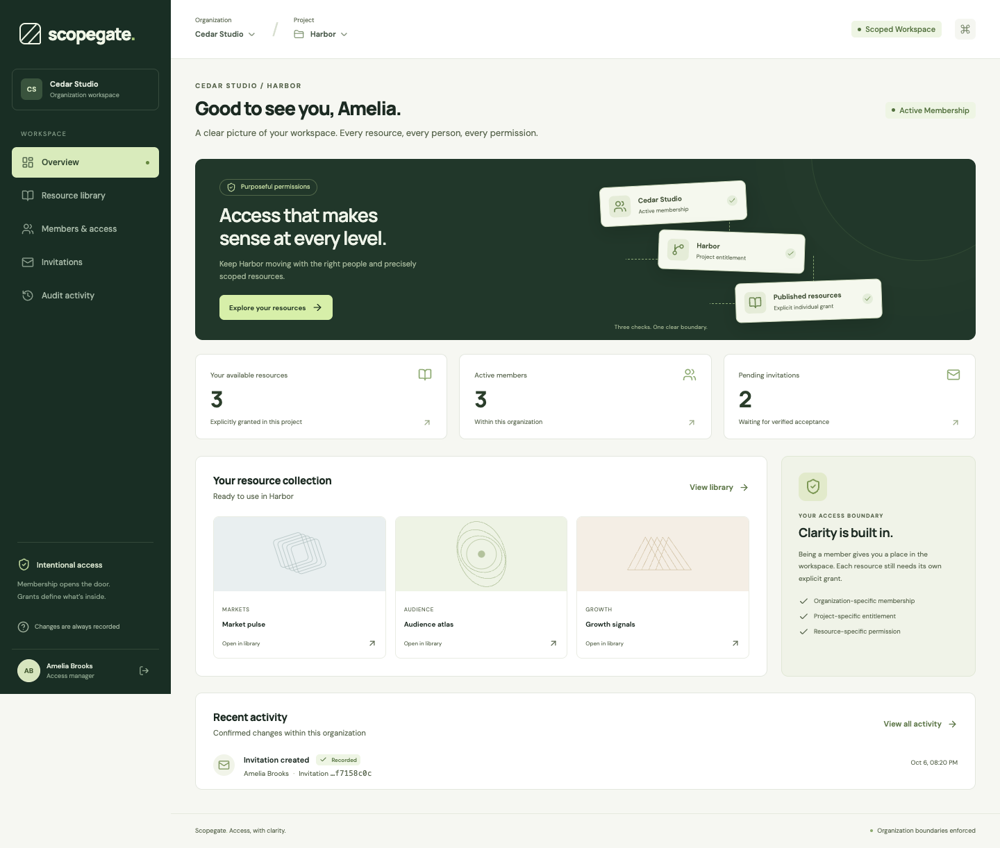

*The running workspace, captured with synthetic data. All screenshots below come from the implemented product.*


## Start here

| Your goal | Recommended path | What to inspect |
| --- | --- | --- |
| Use the product | [Run locally](#run-locally) → [product tour](#product-tour) | Invite a recipient, grant a resource, use it and revoke access |
| Review the solution | [Architecture](#architecture) → [data model](#data-model) → [contracts](#contracts) | Boundaries, invariants, transactions and ownership |
| Present the delivery | [Presentation guide](docs/REVIEW_GUIDE.pt-BR.md) → [guided demonstration](docs/DEMO.pt-BR.md) | An 18-minute narrative and a 15–20-minute product demonstration, in Portuguese |
| Examine quality | [Verification](#verification) → [validation guide](docs/VALIDATION.md) | Real gates, named scenario evidence, failure injection and proof boundaries |
| Operate or extend it | [Operations](docs/OPERATIONS.md) → [implementation map](docs/IMPLEMENTATION_MAP.md) → [engineering decisions](docs/DECISION_MATRIX.md) | Recovery, module ownership and the reasons behind the design |

## What the product does

- **Scoped resource access:** discover entitled project resources, inspect individual grants and open a protected resource under current authorization.
- **Verified onboarding:** prepare a bounded invitation plan, deliver through the protected local mailbox, authenticate the recipient and accept once.
- **Reviewed changes:** preview additions and removals, preserve the draft after a conflict, and confirm the persisted result.
- **Organization isolation:** switch accounts and projects without rendering an old organization's delayed response or selection.
- **Traceable operation:** inspect audit activity, distinguish invitation state from delivery state, and review ambiguous migration records explicitly.

Four separate relationships determine access: **identity → organization membership → project entitlement → individual grant**. A manager role authorizes administration; it grants no implicit content consumption. Catalog publication grants no customer access. Resource titles and translations never determine authorization.

## Run locally

### Prerequisites

Docker with Compose, `make`, and Python **3.10 or newer** for the local secret initializer. Container builds install the locked application dependencies. The first build requires network access to download images and packages.

From the repository root:

```sh
make setup
make up
docker compose ps
```

Wait for the database and web health checks to become healthy and the one-shot `initialize` service to finish successfully. The deployment then has **five running services**. Open **[localhost:5187](http://localhost:5187)** and select a synthetic account through the local identity provider.

| Service | Local endpoint | Purpose |
| --- | --- | --- |
| Workspace | [http://localhost:5187](http://localhost:5187) | Browser application and same-origin API proxy |
| API | [http://localhost:8457/docs](http://localhost:8457/docs) | Interactive HTTP contract documentation |
| Identity provider | [OIDC discovery](http://localhost:8901/.well-known/openid-configuration) | Independent local authorization-code provider |
| PostgreSQL | `localhost:5547` | Primary database; credentials come from ignored local configuration |
| Delivery worker | No published port | Claims committed outbox messages and writes the protected local mailbox |

Published ports bind to the loopback interface. `.env` is generated with restrictive permissions and remains outside version control. The fixture offers account selection without a shared demo password. Opaque session cookies, PKCE, verified claims, state/nonce and same-origin CSRF protection still govern the application flow.

### Demonstration accounts

| Account | Synthetic email | Initial scope | Suggested journey |
| --- | --- | --- | --- |
| Amelia Brooks | `amelia@example.test` | Access manager in Cedar Studio | Manage Harbor/Grove grants, invitations and activity |
| Jonah Reed | `jonah@example.test` | Viewer in Cedar Studio | Use the explicitly granted Market pulse resource |
| Rowan Vale | `rowan@example.test` | Temporary staff assignments in Cedar Studio and Birch Labs | Switch organizations and review migration evidence |
| Morgan Lane | `morgan@example.test` | Invitation recipient | Accept a reviewed plan and receive its selected grants |
| Ellis Park | `ellis@example.test` | Access manager in Birch Labs | Inspect an independent organization's workspace |

These are initial fixture roles, not a promise of reset on restart. Volumes preserve later grants, invitations and audit history. Staff assignments expire seven days after creation; restarting does not extend their validity. Staff roles alone provide no consumption grant.

### Diagnose and stop

```sh
docker compose logs --tail=40 initialize
docker compose logs --tail=40 api
make down                         # Stop this deployment; preserve its volumes
```

If a port is occupied, stop the conflicting process before starting this deployment. Bootstrap applies migrations and seeds the initial workspace idempotently. [Operations](docs/OPERATIONS.md) explains maintenance and recovery; [identity and delivery](docs/IDENTITY_AND_DELIVERY.md) explains local accounts and mailbox behavior.

## Product tour

1. Sign in as **Amelia**, open Cedar Studio and select Harbor. Compare project availability with an individual's explicit grants.
2. Invite **`morgan@example.test`**, select a project/resource plan and review it before confirming. Inspect invitation and delivery status separately.
3. Open the invitation from the manager-protected mailbox in a private browser window. Sign in as **Morgan**, review the recipient plan and accept.
4. Open the newly granted resource. Back in Amelia's session, remove that exact grant with a reason; Morgan's next protected admission must be denied.
5. Inspect the audit trail. Open the same grant review in two windows, submit a change in the first, then submit the older review in the second. Inspect the version conflict, preserved draft and required second review.
6. Sign in as **Rowan**, switch between Cedar Studio and Birch Labs, and inspect the migration ledger. Unknown references require an owner and evidence; the web workbench cannot switch authority.

Use the [guided demonstration](docs/DEMO.pt-BR.md) for the full script. The [presentation guide](docs/REVIEW_GUIDE.pt-BR.md) connects the product journey to design decisions, tradeoffs and operating evidence. The [learning guide](docs/LEARNING_GUIDE.pt-BR.md) explains how to defend those decisions in depth.

## Screenshots

The gallery covers the principal journeys and responsive layouts. Select a caption to open the original capture at full resolution.

| Entry and workspace | Resource discovery |
| --- | --- |
| **[01 · Sign in](docs/screenshots/01-sign-in.png)**<br>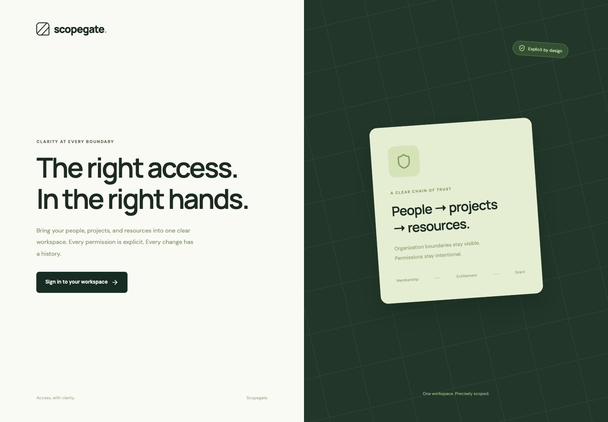 | **[03 · Resource library](docs/screenshots/03-resource-library.png)**<br>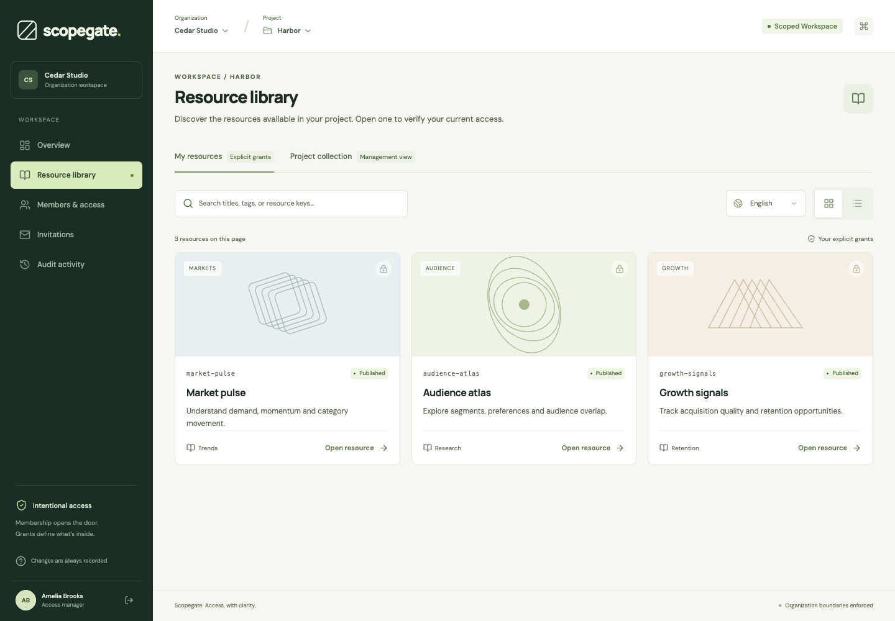 |
| **[02 · Organization overview](docs/screenshots/02-overview.png)**<br> | **[04 · Localized library](docs/screenshots/04-localized-library.png)**<br>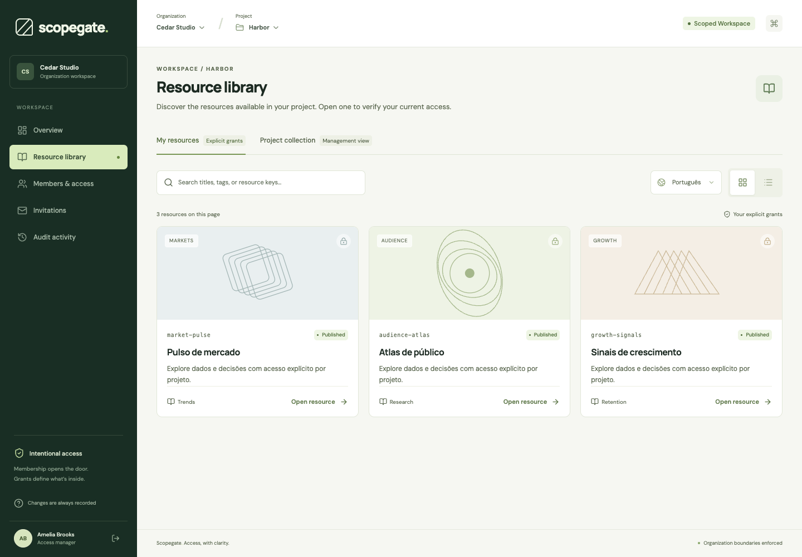 |

| Access management | Invitation lifecycle |
| --- | --- |
| **[05 · Members](docs/screenshots/05-members.png)**<br>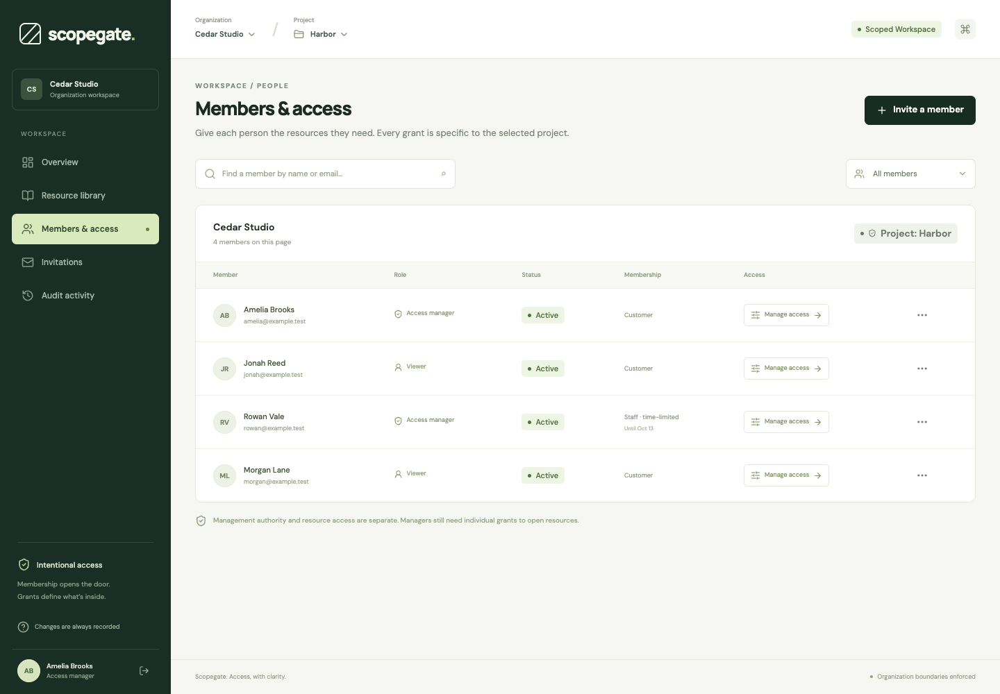 | **[07 · Invitation history](docs/screenshots/07-invitation-history.png)**<br>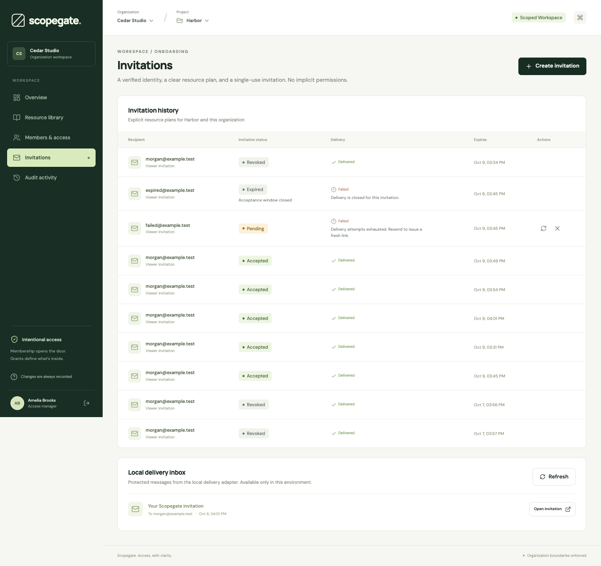 |
| **[06 · Grant change review](docs/screenshots/06-grant-change-review.png)**<br>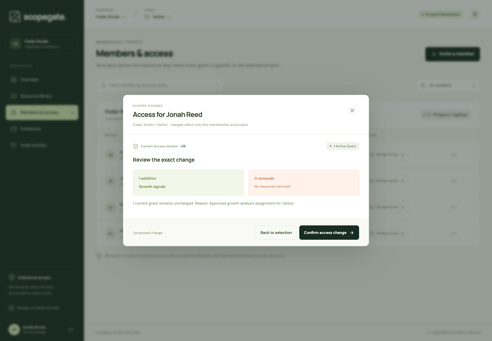 | **[08 · Invitation plan review](docs/screenshots/08-invitation-plan-review.png)**<br>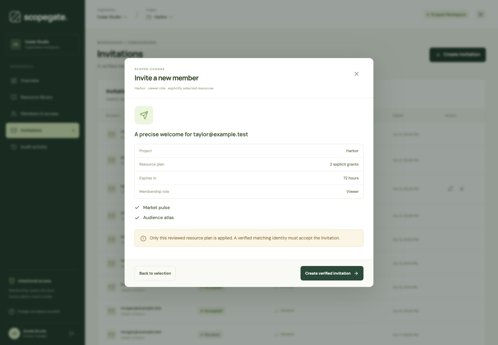 |

| Traceability | Reconciliation |
| --- | --- |
| **[09 · Audit activity](docs/screenshots/09-audit-activity.png)**<br>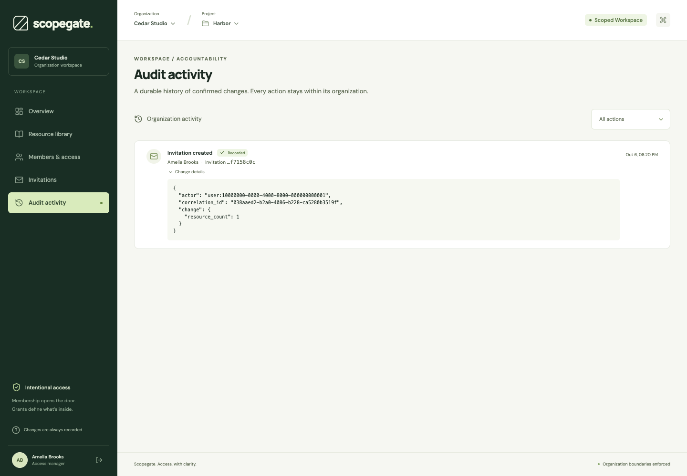 | **[14 · Migration review](docs/screenshots/14-migration-review.png)**<br>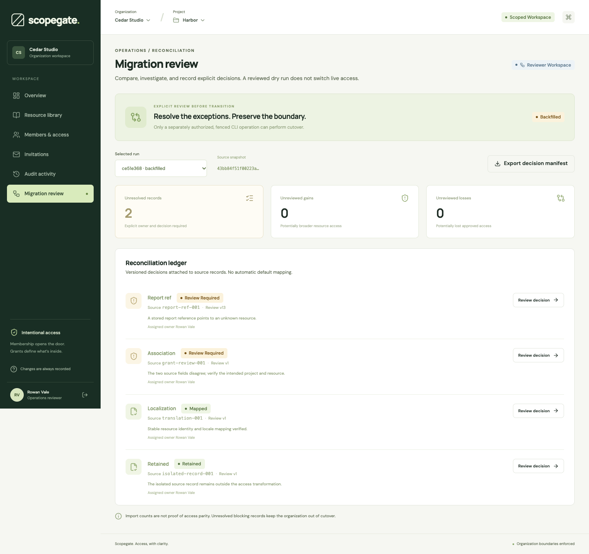 |

**[13 · Recipient plan](docs/screenshots/13-recipient-plan.png)** — verified onboarding with a reviewed organization/project/resource scope.

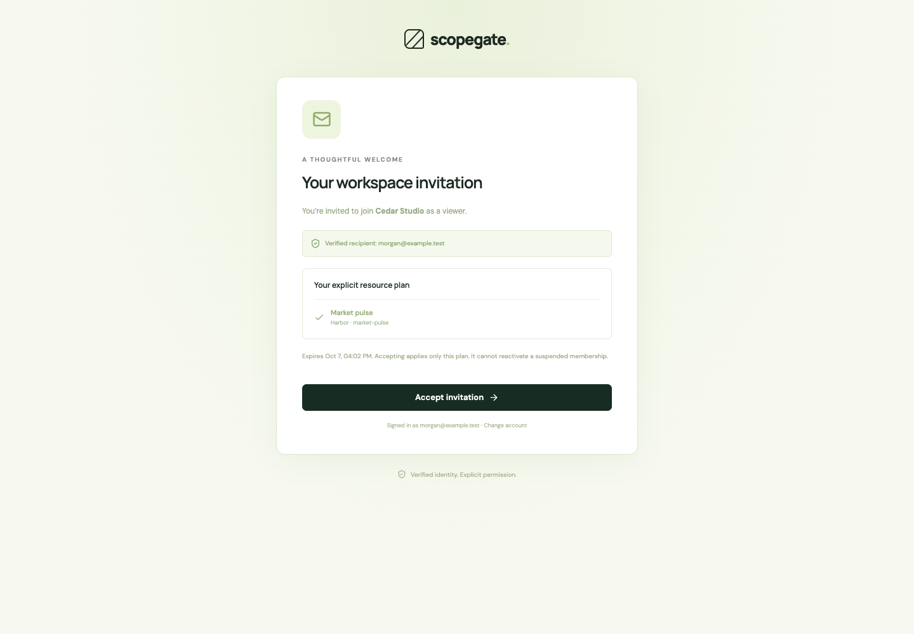

| Tablet overview | Mobile overview | Mobile library |
| --- | --- | --- |
| **[10 · Tablet](docs/screenshots/10-overview-tablet.png)**<br>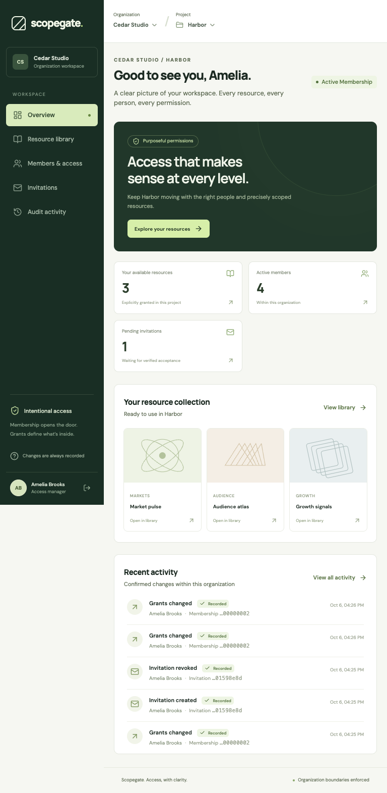 | **[11 · Mobile](docs/screenshots/11-overview-mobile.png)**<br>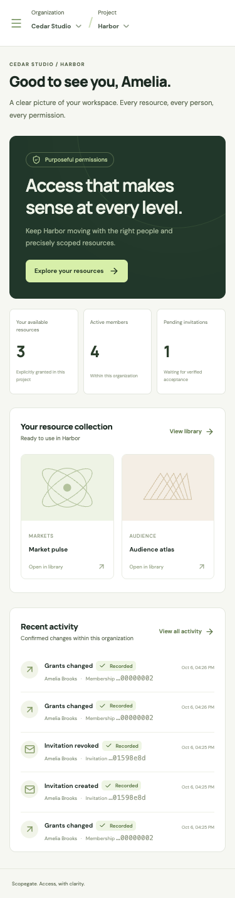 | **[12 · Mobile library](docs/screenshots/12-library-mobile.png)**<br>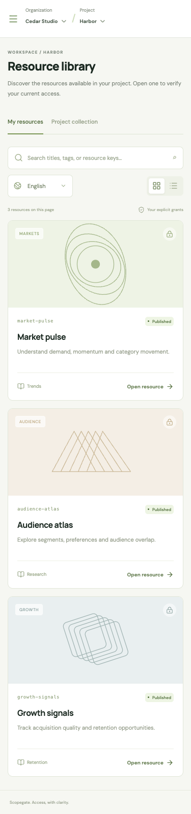 |

The browser gate separately verifies keyboard journeys at **375, 768 and 1440 pixels**, delayed responses across organization switches, panel recovery, competing edits and automated accessibility scans. Screenshots record visible states; the executed tests supply behavioral evidence.

## Architecture

A **modular monolith and one primary PostgreSQL authority** keep policy decisions, grants, receipts and audit events inside explicit transaction boundaries. The same versioned backend image runs the HTTP application and a separate outbox worker. Identity, delivery and recovery journals have external ports with local adapters for the reproducible release.

### System context


[Full-size context](docs/diagrams/context.svg) · [Editable source](docs/diagrams/context.mmd)

### Application and integration boundaries



[Full-size architecture](docs/diagrams/container.svg) · [Editable source](docs/diagrams/container.mmd)

The diagrams show logical boundaries, including separately owned live adapter ports. The local deployment uses the five services listed above; an independently durable production journal remains a live integration requirement.

| Layer | Implementation | Responsibility |
| --- | --- | --- |
| Workspace | React 19, TypeScript, Vite, TanStack Query | Typed HTTP, scoped query keys, reviewed mutations and explicit panel states |
| HTTP boundary | Python 3.12, FastAPI, Pydantic | Validate transport, resolve the principal and delegate use cases |
| Application/domain | Cohesive services and central policy | Authorization, state transitions, transaction ownership and ordered locks |
| Persistence | SQLAlchemy 2, psycopg 3, Alembic | Scoped reads, normalized relations and versioned schema |
| Primary state | PostgreSQL 18 | Tenant constraints, sessions, grants, receipts, audit, migration and outbox |
| Integration adapters | Local OIDC, mailbox and independent journal | Verified identity, postcommit delivery and synthetic recovery exercises |

### Decisions that shape behavior

| Decision | Practical effect | Further reading |
| --- | --- | --- |
| Explicit grants and separate administrative roles | A manager or staff flag cannot silently widen consumption | [Access decision](docs/adr/0002-explicit-resource-grants.md) |
| Organization-aware composite foreign keys | Cross-organization relationships are rejected structurally | [Data model](docs/DATA_MODEL.md) |
| Canonical lock order and fresh post-lock reads | Revocation and protected use have an observable transactional order | [Transaction correctness](docs/DISTRIBUTED_CORRECTNESS.md) |
| Optimistic versions and actor-scoped receipts | Stale edits require review; retries do not repeat transitions or restore revoked access | [Domain design](docs/DOMAIN_DESIGN.md) |
| Atomic changes and append-only audit | A change commits with its evidence or rolls back together | [Architecture](docs/ARCHITECTURE.md) |
| Durable outbox with bounded claims and lease ownership | Delivery can recover without broadening invitation acceptance | [Reliability](docs/RELIABILITY_DESIGN.md) |
| Reviewed migration and a compatible application rollback | Ambiguity is not converted into permission; rollback retains target authority | [Migration](docs/MIGRATION.md) |

DRY centralizes business rules and error mapping. Services own transactions; handlers delegate. Interfaces are placed at real integration boundaries. [Engineering decisions](docs/DECISION_MATRIX.md) and the [standards registry](docs/ENGINEERING_STANDARDS.md) explain adopted, deferred and rejected patterns.

## Data model

The canonical SQL defines **21 domain/supporting tables**. Runtime migrations also maintain Alembic's version table. Immutable issuer/subject identity, membership ownership, project entitlements, individual grants, invitation references and consuming report references form the access model.



[Full-size entity relationships](docs/diagrams/er.svg) · [Editable source](docs/diagrams/er.mmd)

The ER view highlights core relationships and selected columns. [schema.sql](specs/contracts/schema.sql) specifies the complete physical model, constraints and supporting tables; [DATA_MODEL.md](docs/DATA_MODEL.md) explains its invariants and lifecycle rules.

| Boundary | Invariant |
| --- | --- |
| Identity | Issuer and subject identify the account; matching display emails do not merge identities |
| Membership | One user/organization pair; suspended or expired membership denies use |
| Manager continuity | At least one active, non-expiring customer manager remains; temporary staff does not satisfy continuity |
| Entitlement and grant | Both must be active for the exact organization/project/resource combination |
| Protected use | Current permission is checked after locks; earlier browser state is not authority |
| Destructive changes | Entitlement disable revokes exact-pair grants and affected invitations atomically; reenable restores nothing implicitly |
| Catalog | Stable resource identity; translations change presentation; archival is terminal |
| Recovery | Unreconciled or uncertain operations retain the fence before traffic reopens |

### Critical protocols

<details>
<summary>Verified invitation and single-use acceptance</summary>

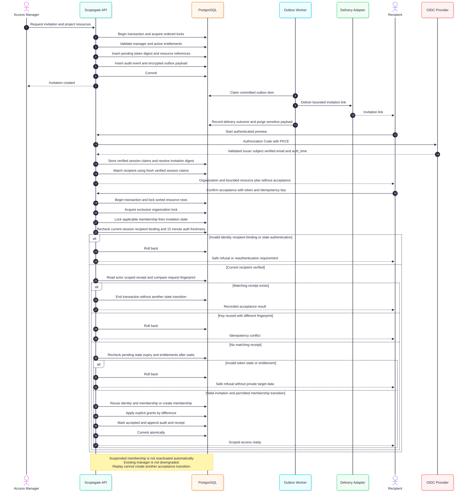

[Editable source](docs/diagrams/invitation-sequence.mmd) · [Identity and delivery contract](docs/IDENTITY_AND_DELIVERY.md)

</details>

<details>
<summary>Concurrent resource use and grant revocation</summary>

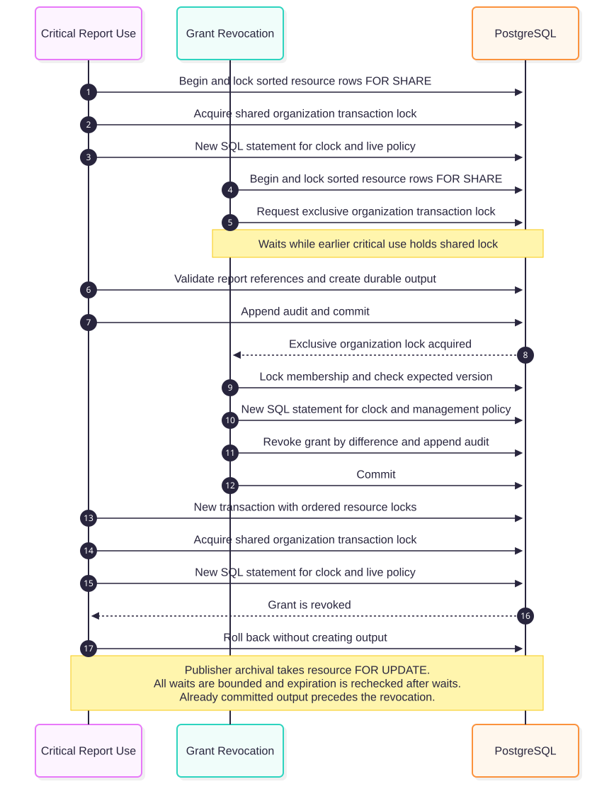

[Editable source](docs/diagrams/grant-revocation.mmd) · [Transaction protocol](docs/DISTRIBUTED_CORRECTNESS.md)

</details>

<details>
<summary>Reviewed migration, target cutover and compatible rollback</summary>


[Editable source](docs/diagrams/migration-phases.mmd) · [Migration design](docs/MIGRATION.md)

</details>

All six diagram sources and rendered SVGs are indexed in [diagrams/README.md](docs/diagrams/README.md). SVGs remain legible when enlarged.

## Contracts

| Contract | Scope |
| --- | --- |
| [OpenAPI](specs/contracts/openapi.json) | 35 HTTP operations, request/response shapes, required headers and safe errors |
| [Canonical SQL](specs/contracts/schema.sql) | Domain tables, uniqueness, checks, indexes and organization-aware foreign keys |
| [Policy cases](specs/contracts/policy-cases.json) | Positive and negative examples of the authorization intersection |
| [Live migration specification](specs/contracts/migration-cli.json) | Specified future commands and private integration gates; separate from the implemented local CLI |
| [Local operations](specs/contracts/local-operations.json) | Implemented `python -m scopegate.cli` commands for synthetic profiling, backfill, comparison, fencing, cutover and recovery |
| [Capacity](specs/contracts/capacity.json) / [resilience](specs/contracts/resilience.json) / [objectives](specs/contracts/slo.json) | Proposed deployment budgets, ownership and required measurement |
| [Acceptance specifications](specs/README.md) | Eight feature scopes, 67 acceptance scenarios and task dependencies |

Run local maintenance through the opt-in Compose service so commands share the deployed journal and mailbox volumes:

```sh
docker compose --profile maintenance run --rm --build operations --help
```

[Identity and delivery](docs/IDENTITY_AND_DELIVERY.md) documents credential inputs and operator responsibilities.

The OpenAPI contract is independent of the application-generated schema. Contract tests compare their surface, validate real responses and check frontend type drift. Structural SQL assertions run in disposable PostgreSQL; runtime tests separately prove role, clock, concurrency and current-state rules.

## Verification

The release workflow requires **12 passing gates**, **67 mapped acceptance records** and **13 local task proofs**. Scenario records bind named passing tests or explicitly documentary reviews; they are not a count of 67 independent automated tests. Live discovery decisions cannot be certified by synthetic data.

| Gate | Command | Evidence focus |
| --- | --- | --- |
| G-LINT | `make lint typecheck` | Static rules, backend type checking and strict frontend types |
| G-DOMAIN | `make test-unit` | Policy, CLI/runtime behavior, meaningful policy mutations and frontend units |
| G-DATABASE | `make test-integration` | Real PostgreSQL constraints, transitions and controlled races |
| G-CONTRACT | `make check-contracts` | Independent HTTP contract and generated-type drift |
| G-BROWSER | `make test-browser` | Six real journeys, keyboard operation, accessibility and delayed-scope responses |
| G-MIGRATION | `make test-migration` | Synthetic diagnosis, reviewed mapping, parity and fencing |
| G-IDENTITY | `make test-identity` | Signed OIDC exchange, claims, sessions and recipient-bound onboarding |
| G-BUILD | `make build smoke` | Production build, images and actual running services |
| G-PERFORMANCE | `make test-performance` | Bounded internal-network arrivals, pressure, denials and connection limits |
| G-SECURITY | `make test-security` | Negative authority cases, dependency audits and software inventories |
| G-OPERATIONS | `make test-operations` | Worker shutdown, proxy replacement, compatible artifact rollback and recovery |
| G-RELEASE | `make check-runtime` | Specification consistency, negative validator fixtures and final runtime smoke |

### Reproduce the release checks

Verification requires `uv`, Node.js **24**, npm, Python **3.12** through uv, Docker Compose and a Playwright browser. macOS uses installed Chrome; Linux/CI installs Chromium. The compatible rollback rehearsal requires the current commit and its parent in Git.

```sh
make deps

# Linux/CI browser installation:
npm --prefix frontend exec -- playwright install --with-deps chromium

# Start the product, then collect all canonical gates:
make up
make verify
make check-evidence
make package
```

Commit intended source changes before `make verify`: the collector requires a clean committed implementation revision. It writes `specs/implementation-evidence.json` after execution and hashes each included report. That generated manifest is the permitted post-commit change. Missing tools, nonzero exits, skipped tests, stale revisions, missing artifacts and duplicate report paths block completion.

Backend integration and capacity tests use the separate `scopegate_test` database and never truncate the displayed workspace. Browser journeys run against the real local application and change its synthetic invitations, grants and audit history. The local benchmark uses approximately 10,000 resources, 40,000 localized rows and 10,000 grants with one bounded API process and a separate load generator. It measures the internal network, not browser-edge transport or sustained production capacity. [VALIDATION.md](docs/VALIDATION.md) describes the exact proof boundaries.

For a focused structural rehearsal, `make check-schema` starts an owned disposable PostgreSQL instance, executes DDL, positive/negative constraints and controlled lock schedules, then removes that instance.

### Review archive

`make package` creates `artifacts/review/scopegate-<revision>.zip` from public committed source and the current verified proof. It includes the screenshots, diagrams, contracts and documentation above, plus selected hashed test reports. Credentials, dependency directories, old failed logs and private inputs stay outside the archive.

```sh
python3 scripts/package_review.py --verify /path/to/scopegate-<revision>.zip
```

Offline verification checks inventory, hashes, executable modes and archive integrity. After extraction, `make setup` and `make up` start the local product. Revision-dependent verification requires the original Git checkout at the recorded commit and its compatible parent; the archive does not contain Git history. A new independent Git copy needs its own compatible baseline and freshly collected proof.

The [workflow](.github/workflows/product.yml) uses the same canonical gates. Remote workflow execution remains unverified until publication. Public source checkouts contain the collection structure; the generated review bundle carries populated release evidence.

## Repository map

```text
backend/             FastAPI application, domain policy, persistence, migrations and tests
frontend/src/        React workspace, feature modules and typed API client
frontend/e2e/        Real browser journeys and interaction evidence
identity_provider/   Independent local OIDC fixture
specs/features/      Acceptance scenarios and invariants
specs/contracts/     Independent HTTP, SQL, policy and operating contracts
docs/                Product, architecture, execution, operating and learning material
docs/adr/            Recorded architecture decisions
docs/diagrams/       Six editable Mermaid sources and rendered SVGs
docs/screenshots/    Fourteen captures from the running workspace
scripts/             Setup, validators, audits, rehearsals and release packaging
compose.yaml         Owned local service deployment
Makefile             Shared developer and release entry points
```

## Documentation

| Topic | Recommended documents |
| --- | --- |
| Product and delivery | [Product](docs/PRODUCT.md), [requirements](docs/REQUIREMENTS.md), [executive proposal](docs/PROPOSTA.pt-BR.md), [local scope](docs/LOCAL_PRODUCT.md) |
| Architecture and correctness | [Architecture](docs/ARCHITECTURE.md), [domain design](docs/DOMAIN_DESIGN.md), [data model](docs/DATA_MODEL.md), [transaction correctness](docs/DISTRIBUTED_CORRECTNESS.md), [decision matrix](docs/DECISION_MATRIX.md) |
| Interface and onboarding | [UX](docs/UX.md), [API](docs/API.md), [identity and delivery](docs/IDENTITY_AND_DELIVERY.md), [demonstration](docs/DEMO.pt-BR.md) |
| Migration and execution | [Diagnosis](docs/DIAGNOSIS.md), [migration](docs/MIGRATION.md), [delivery plan](docs/DELIVERY_PLAN.md), [product alignment](docs/PRODUCT_ALIGNMENT.pt-BR.md) |
| Quality and operation | [Validation](docs/VALIDATION.md), [quality](docs/QUALITY.md), [security](docs/SECURITY.md), [operations](docs/OPERATIONS.md), [capacity](docs/CAPACITY_PLAN.md), [reliability](docs/RELIABILITY_DESIGN.md), [delivery system](docs/DELIVERY_SYSTEM.md) |
| Learning and review | [Presentation guide](docs/REVIEW_GUIDE.pt-BR.md), [learning guide](docs/LEARNING_GUIDE.pt-BR.md), [engineering standards](docs/ENGINEERING_STANDARDS.md), [completion contract](docs/COMPLETION_CONTRACT.md) |

Technical documentation is in English; presentation, demonstration and learning material are available in Portuguese. Contract and specification ownership are stated in [AGENTS.md](AGENTS.md) and [specs/README.md](specs/README.md).

## Delivery boundary

**This is a complete, reproducible local product using synthetic accounts and operating fixtures.** Tasks T00–T12 define the closed release. Real identity/notification providers, reviewed live access intent, host-loss journal durability, production traffic migration and sustained service objectives require their own integrations and operating evidence. Tasks T13–T14 describe that later live work.

Production configuration refuses startup while the real adapters remain unimplemented. Local operating drills demonstrate policy-preserving recovery and compatible rollback without certifying host-loss resilience or a production service level. The migration workbench reviews evidence; controlled CLI gates own cutover.

## License

[MIT](LICENSE).
