# Scopegate Architecture

Scopegate is an implemented local organization access workspace. A modular monolith and one primary PostgreSQL database keep permission changes, single-use invitation acceptance, command receipts and audit evidence in the same transaction. A separate process delivers committed invitations. The reproducible deployment includes local identity, mailbox and recovery journal adapters; live provider and host integration remain outside this release.

Read this document for system boundaries and operating behavior, [Domain design](DOMAIN_DESIGN.md) for source responsibilities, [Data model](DATA_MODEL.md) for persistence and [Transaction correctness](DISTRIBUTED_CORRECTNESS.md) for exact race schedules. [Current release evidence](../specs/implementation-evidence.json) establishes which gates passed for a revision; this document does not replace that proof.

## Architecture views and authority

| View | Question it answers | Source of truth |
| --- | --- | --- |
| [System context](diagrams/context.svg) | Who uses the product, and which authorities remain separate? | [Product](PRODUCT.md), [security](SECURITY.md) |
| [Logical application boundaries](diagrams/container.svg) | What belongs to the application, persistence and integration ports? | This document and [domain design](DOMAIN_DESIGN.md) |
| [Implemented components](diagrams/components.svg) | Which source modules validate, decide, transact and integrate? | [Implementation map](IMPLEMENTATION_MAP.md) and linked source below |
| [Local deployment](diagrams/deployment.svg) | Which processes, ports, volumes and credentials actually run? | [compose.yaml](../compose.yaml), [runtime configuration](../backend/src/scopegate/config.py) |
| [Entity relationships](diagrams/er.svg) | Which records own identity, access, evidence and recovery state? | [Canonical SQL](../specs/contracts/schema.sql), [Alembic migration](../backend/migrations/versions/0001_target.py) |
| [Invitation](diagrams/invitation-sequence.svg), [revocation](diagrams/grant-revocation.svg), [migration](diagrams/migration-phases.svg) | How do critical transitions order work and handle uncertainty? | Owning services and contracts |

The context and logical views express responsibilities. The deployment view expresses the implemented Compose topology. Proposed capacity changes and real external adapters are described as future operating decisions rather than extra deployed services.

## Product and trust boundaries

An organization is the tenant boundary; a project belongs to exactly one organization. A globally published resource is available to that organization only through an active project entitlement. Consumption additionally requires an active unexpired membership and the exact active membership/project/resource grant. Manager authority, staff status, catalog publication, resource names and email domains grant no implicit consumption access.

| Boundary | Trusted input and verification | Authority it does not confer |
| --- | --- | --- |
| Browser → HTTP | Opaque session cookie; session-bound CSRF token and exact origin for mutations; bounded validated payload | A path organization ID, selected card or cached permission is requested scope |
| OIDC → identity service | Configured issuer, allowed algorithm/audience, validated signature, state/nonce, PKCE and trusted authentication claims | Display email cannot merge identities; provider login alone assigns no membership |
| Platform → platform operations | Distinct platform bearer credential and allowlisted operations | Provisioning authority does not allow resource consumption |
| Publisher → catalog | Distinct Publisher bearer credential, external-key/version checks and catalog-only handlers | Publication cannot write customer memberships, entitlements or grants |
| Maintenance → local CLI | Separate operations credential, expected epoch and reviewed synthetic manifests | A web migration review cannot switch writer authority |
| Application → primary database | Runtime role, scoped SQL, composite constraints, current policy and cooperating lock protocol | Direct table integrity does not implement time, role or advisory-lock policy |
| Delivery/recovery → local storage | Protected volumes and safe identifiers; journal intent/outcome is separate from database recovery | A delivered link or journal record is not a second permission store |

See [Security](SECURITY.md) for threats and [Identity and delivery](IDENTITY_AND_DELIVERY.md) for identity/provider limits. There is no global administrative consumption bypass.

## Actual local deployment

[Editable deployment source](diagrams/deployment.mmd) · [Compose definition](../compose.yaml)

Five services remain running after one-shot initialization. The maintenance service runs only when its profile is explicitly selected.

| Service | Process and endpoint | Durable storage and responsibility |
| --- | --- | --- |
| `web` | Unprivileged nginx on container port 8080; loopback `5187` | Built React assets; same-origin `/api`, `/auth` and `/health` proxy to `api:8457` |
| `api` | One container, two Uvicorn application worker processes; loopback `8457` | Runtime database connection, journal and mailbox volumes; HTTP commands and protected reads |
| `database` | PostgreSQL 18; loopback `5547` maps container 5432 | `database` volume; sole authority for sessions, entitlements, grants, receipts, audit, migration and outbox |
| `identity` | Independent local OIDC application; loopback `8901` | Reserved volume mount; fixture signing key and authorization codes are process-local |
| `worker` | `python -m scopegate.worker`; no published port | Runtime database connection and `mailbox` volume; committed outbox claims and delivery |
| `initialize` | One-shot `python -m scopegate.bootstrap` after database readiness | Separate migration credential; applies Alembic, configures runtime privileges and seeds idempotently |
| `operations` | Opt-in `maintenance` profile; `python -m scopegate.cli` | Runtime database credential plus operations key; shared journal/mailbox and read-only migration fixtures |

The same versioned backend image supplies API, worker, identity fixture, initializer and operations CLI. This is process separation around one application. Initialization completes before API and worker start. Browser redirects use the public OIDC issuer; the API exchanges codes and fetches configured discovery/JWKS through the internal identity address. Issuer validation still uses the configured public issuer. The [local provider](../identity_provider/app.py) regenerates its signing key and drops in-flight authorization codes on process restart; its mounted volume is currently unused. A new login uses the new JWKS key, while established opaque application sessions retain their primary-database lifecycle. This fixture does not promise persistent production provider state.

The web proxy resolves the Docker service name dynamically so an API container replacement does not leave a stale upstream address. All published ports bind to loopback. Local HTTP and synthetic accounts are demonstration configuration; production validation refuses the unimplemented live delivery/journal/host adapters and insecure local configuration.

### Credential and persistence ownership

Only `initialize` receives the privileged migration database URL. API and worker explicitly receive an empty migration URL and use `scopegate_app`, which cannot own the schema, create roles/databases, bypass row security or mutate/delete existing audit rows. The application receives INSERT/SELECT on audit; Alembic's version table is read-only. These database restrictions complement service authorization; API, worker and maintenance currently share the runtime database role rather than table-specific roles.

API receives session/cursor, outbox, platform and Publisher keys. Worker receives the outbox key and runtime database connection. Maintenance receives its separate operations key and outbox key. The web image contains no application credentials. Ignored local configuration is generated with restrictive permissions; [bootstrap.py](../backend/src/scopegate/bootstrap.py) and [compose.yaml](../compose.yaml) are the exact privilege and environment definitions.

Journal and mailbox volumes are outside the recovered database volume, so the local recovery rehearsal can retain newer intent while restoring database state. They still share the Docker host. A host-loss or independently durable production recovery guarantee requires an external adapter and separate proof. Local trace files are safe diagnostic output in the API container, not an external telemetry service or a recovered authority.

### Budgets and availability boundary

Each API process has a pool of four persistent connections plus one overflow connection; two processes allocate at most ten. Worker allocates two; an opt-in maintenance process allocates two. PostgreSQL allows 60 total connections, leaving space for initialization, probes and rehearsals. Processes do not share their Python pool or admission counters. Replacement and larger topologies need a new aggregate budget.

Current limits are 16 admitted HTTP requests and eight waiting requests per process, with a 50 ms admission wait; database pool wait is 100 ms, lock timeout 250 ms, statement timeout 750 ms and transaction timeout 1,200 ms. [config.py](../backend/src/scopegate/config.py), [db.py](../backend/src/scopegate/db.py) and [observability.py](../backend/src/scopegate/observability.py) own those values. The capacity gate measures a bounded single API process on the internal Docker network; it does not certify nginx/browser transport, sustained production load or the aggregate two-process topology.

Compose restart policies and health checks support a local demonstration. One host and one primary database remain failure domains; there is no automatic database failover, cluster orchestrator or replicated authorization store. [Capacity](CAPACITY_PLAN.md) and [reliability](RELIABILITY_DESIGN.md) specify the evidence needed before changing that topology.

## Implemented component boundaries

[Editable component source](diagrams/components.mmd) · [Detailed ownership](DOMAIN_DESIGN.md#implemented-component-layout)

FastAPI adapters in `api/` parse bounded transport types and delegate. Cohesive use-case functions in `services/` own transactions through `db.transaction()`. The pure predicate in `domain/policy.py` accepts facts and an explicit decision time without importing FastAPI or database adapters. SQLAlchemy Core executes parameterized scoped statements; the implementation does not use an ORM repository hierarchy or a custom unit-of-work framework.

| Responsibility | Implemented owner | Shared boundary |
| --- | --- | --- |
| Principal, OIDC and session lifecycle | [dependencies.py](../backend/src/scopegate/dependencies.py), [services/identity.py](../backend/src/scopegate/services/identity.py) | Session validation completes before tenant transaction locks |
| Organizations, projects and memberships | [services/workspace.py](../backend/src/scopegate/services/workspace.py), [invariants.py](../backend/src/scopegate/services/invariants.py) | Scoped management authority and durable manager continuity |
| Grant delta and protected report configuration | [services/access.py](../backend/src/scopegate/services/access.py) | Central policy and ordered resource/organization locks |
| Catalog/search and entitlement transitions | [catalog.py](../backend/src/scopegate/services/catalog.py), [entitlements.py](../backend/src/scopegate/services/entitlements.py) | Publication is global; availability is an exact organization/project/resource relation |
| Invitation acceptance and committed delivery | [enrollment.py](../backend/src/scopegate/services/enrollment.py), [delivery.py](../backend/src/scopegate/services/delivery.py), [worker.py](../backend/src/scopegate/worker.py) | Transactional encrypted outbox; external send after claim commit |
| Migration, compatibility and restore | [migration.py](../backend/src/scopegate/services/migration.py), [compatibility.py](../backend/src/scopegate/services/compatibility.py), [recovery.py](../backend/src/scopegate/services/recovery.py), [cli.py](../backend/src/scopegate/cli.py) | Explicit evidence, writer epoch and restore fence |
| Receipts, audit, scoped authority and cursors | [services/common.py](../backend/src/scopegate/services/common.py) | Caller-owned transaction; no independent commit |
| Independent journal | [journal.py](../backend/src/scopegate/journal.py) | No journal I/O while domain locks are held |
| Causal diagnostic context and safe signals | [telemetry.py](../backend/src/scopegate/telemetry.py), [observability.py](../backend/src/scopegate/observability.py) | Fixed span/label vocabulary, bounded async local export and no command authority |

DRY centralizes repeated business rules, error mapping, lock primitives and receipt binding. It does not merge similar-looking operations with different authority or lifecycle semantics. Read projections may join several contexts, but write ownership stays explicit. Adding a broker, generic repository or policy engine requires a recorded problem and evidence, rather than a pattern inventory.

## Critical protocols

### Protected use and revocation

An initial visibility read conceals foreign identifiers but grants no lasting permission. Critical output then starts a bounded READ COMMITTED transaction, locks resource rows in UUID order `FOR SHARE`, acquires the organization's shared advisory transaction lock, and reads current scoped facts in a new statement. Database wall clock is captured after waits. All referenced resources must pass policy before the report configuration and references commit.

Grant mutations take those resource locks and the exclusive organization lock, recheck current manager authority, serialize the actor/organization/operation/key receipt lookup, and lock the target membership before applying a new versioned delta. Invitation acceptance and entitlement disable additionally lock their affected membership and invitation rows in deterministic order. Membership-only changes never acquire resource locks afterward; catalog archival takes `FOR UPDATE` on the resource and never acquires an organization lock.

An earlier critical use can commit before a waiting revocation. Once revocation commits, a later protected admission sees the revoked grant and denies. Revocation cannot remove a previously produced artifact. Ordinary list reads provide current authorized rows at their statement snapshot; the browser view is not a commit-ordered authorization ticket. See [Revocation sequence](diagrams/grant-revocation.svg) and [exact lock schedules](DISTRIBUTED_CORRECTNESS.md).

### Atomic mutation, receipt and independent journal

Journal-required commands prepare safe intent before starting the domain transaction. Within that transaction, changed domain rows, versions, audit and the actor-scoped response receipt commit together. A matching receipt replay checks current authority and returns its recorded result without applying the old delta. A changed fingerprint yields `409`; a new stale expected version yields `412`.

After the connection is released, the wrapper appends the journal outcome. Failure before preparation produces `503` with no domain effect. Failure to confirm outcome after commit produces observable uncertainty: retry the same command key and payload, then reconcile; do not submit a replacement key or describe the operation as rolled back. The journal is recovery evidence rather than a second authorization store, and there is no distributed atomic-commit claim. See [Delivery system](DELIVERY_SYSTEM.md) and the concrete [journal wrapper](../backend/src/scopegate/services/common.py).

### Invitation and outbox

Invitation creation writes a token digest, explicit plan, audit, receipt and encrypted delivery intent atomically. Worker claims committed messages using `FOR UPDATE SKIP LOCKED`, assigns a 30-second lease and commits before sending to the local mailbox. Acknowledgment matches the current lease token and generation; stale workers change no row. A crash after send can cause a repeat delivery, while verified invitation acceptance remains one database transition.

Delivery state and invitation state are distinct. Acceptance uses trusted recent verified recipient claims, repeats expiry and entitlement checks after waits, preserves a suspended membership and never downgrades an existing manager. Terminal ciphertext purge is bounded and delayed by its retention window; it is not synonymous with successful delivery. [Invitation sequence](diagrams/invitation-sequence.svg), [Identity and delivery](IDENTITY_AND_DELIVERY.md) and [Reliability](RELIABILITY_DESIGN.md) own the complete contracts.

## Failure behavior and operator signals

| Failure or competing action | Product behavior | Recovery and evidence |
| --- | --- | --- |
| Invisible object or wrong organization | Scoped `404`; no foreign metadata returned | Negative policy, HTTP contract and database cases |
| Active organization membership lacks required management role | `403`; no mutation | Current scoped role check |
| Version or impact changed since review | `412`; no partial change | UI retains draft and requires a fresh review |
| Admission, pool or lock budget exhausted | Bounded `429` or `503`; failed transaction rolls back | Safe correlation ID, bounded category and retry guidance |
| Primary database unavailable | Protected work fails; no cache/replica fallback | Readiness and database failure signals |
| Identity provider fails | No new verified login; existing sessions retain their defined lifetime | Provider tests; account disable is separate from local logout |
| Worker stops or delivery fails | Outbox remains visible for lease/retry recovery; invitation acceptance rules remain unchanged | Pending age, failed delivery count, reviewed replay/purge |
| Journal preparation or outcome fails | Preparation denies; postcommit outcome remains uncertain | Same-key receipt retry and independent reconciliation |
| Restored database lacks later access changes | External local marker fences access before reconciliation | Retain restrictions and invalidate restored tokens before reopening |

Metrics use bounded route/method/status labels. Safe structured logs carry correlation IDs, not cookies, recipient tokens or payloads. Causal traces connect HTTP admission to command, database transaction and provider spans; validated traceparent inside the encrypted outbox reconnects the separate worker delivery attempt. Parent span IDs preserve causality, while fixed operation/dependency names and allowlisted HTTP attributes exclude SQL, URLs, recipient payloads and exception messages. Trace metadata is removed before the delivery adapter/mailbox and participates in neither policy nor the command fingerprint.

Local API and worker initialization use asynchronous export with a 256-span queue, 64-span batch and 500 ms schedule. Queue pressure or export failure can lose diagnostic evidence; it cannot change a business result or replace an error. Export flush is best effort outside transactions. These bounds protect the producer from synchronous file I/O, not a production trace-retention or telemetry-availability guarantee. [Tracing cases](../backend/tests/test_tracing.py) exercise causal linkage, redaction, legacy/invalid envelopes and failure isolation. `/metrics` requires the platform credential. Each API process has its own counters; a scrape of one worker is not a complete two-process aggregation. Synthetic operations snapshots and release artifacts demonstrate local behavior; a production telemetry backend and collection strategy need their own deployment design.

## Evolution and delivery boundary

The local migration fixture exercises provenance, reviewed ambiguity, resumable backfill, decision comparison, fencing, target cutover and permission-preserving recovery. The web workbench reviews evidence; the CLI owns writer transitions. After target cutover, application rollback may restore only a target-compatible version while retaining target state and the legacy writer fence. A backfill alone is not permission to switch live traffic.

Real source/writer inventory, production identity and delivery providers, independently durable journal/host recovery, intended access approval and monitored cohorts remain live prerequisites. Database engine upgrade is a separate change from authorization-model migration. Row security and separate database roles for independent consumers are future defenses when new database consumers justify them, rather than guarantees of this local runtime.

The [modular monolith decision](adr/0001-modular-monolith.md), [migration design](MIGRATION.md), [risk register](RISK_REGISTER.md) and [release workflow](../specs/execution.json) capture triggers, owners and evidence for these changes. Current scope is the complete local product and its measured release.
